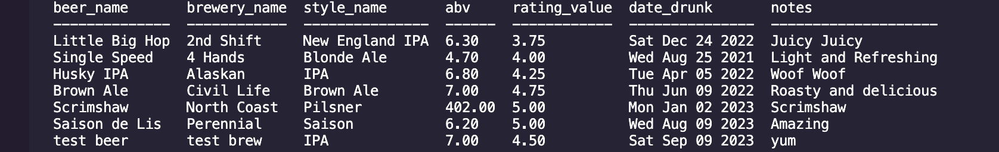
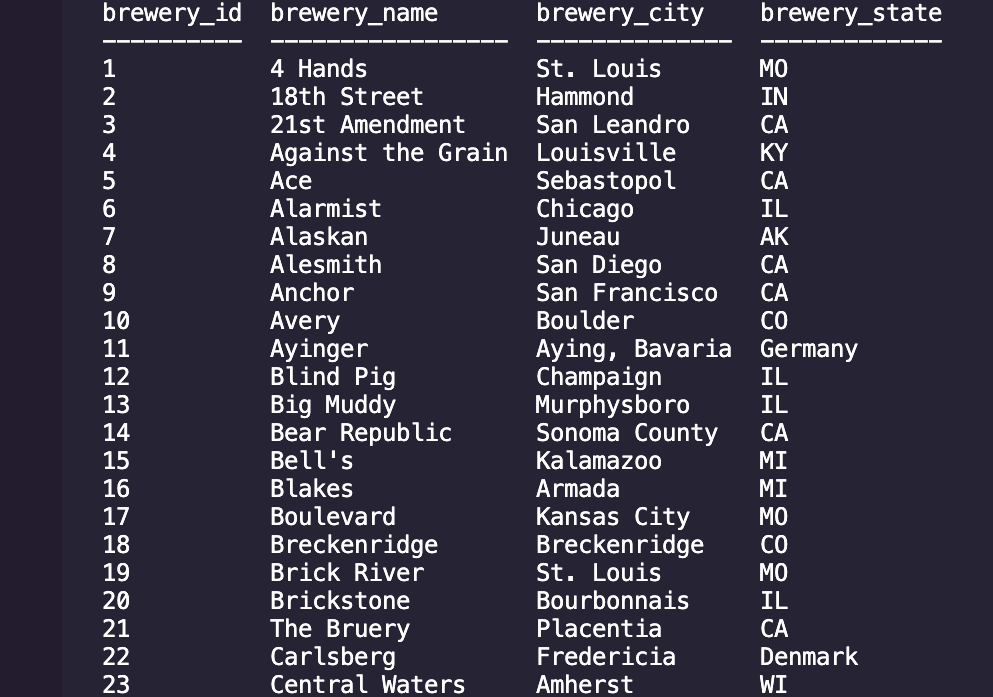
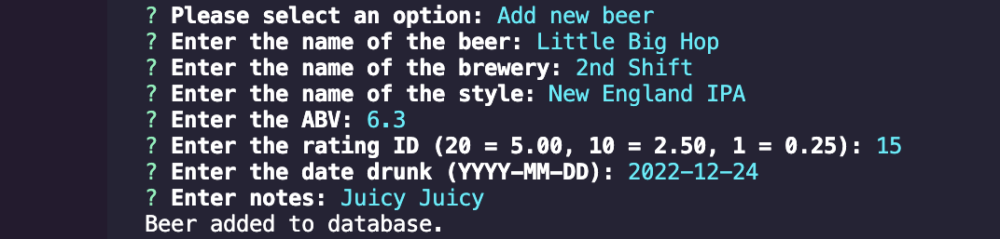

# Beer to SQL

## License
### 
### [MIT](https://opensource.org/licenses/MIT)

## Description

Back end database using SQL, Javascript and Inquirer to track all the beers a user has drank, complete with rating, style, brewery and date drunk. Inspired by Untappd, but build by hand for fun to strengthen back-end portfolio.

By: [Vincent Toon](https://github.com/Vincenttoon)

## Table of Contents

* [Installation](#installation)

* [Technologies](#technologies)

* [Tests](#tests)

* [Usage](#usage)  

* [Future Improvements](#future-improvements)

* [Bugs](#bugs)

* [Questions?](#questions)

## Installation

- Head to the repository to download or view this code: [beer_to_sql](https://github.com/Vincenttoon/beer_to_sql)

- Install [NPM](https://www.npmjs.com/): `npm i -y`. 

- Install [MySQL](https://coding-boot-camp.github.io/full-stack/mysql/mysql-installation-guide). 

- Create and Seed database (node seeds/index.js). 

- Run code using `node index.js`

- Enjoy

## Technologies

- Javascript

- [express](https://www.npmjs.com/package/express)

- [inquirer](https://www.npmjs.com/package/inquirer)

- [mysql2](https://www.npmjs.com/package/mysql2)

## Tests

* [Video Demonstration](https://drive.google.com/file/d/1qeD1Cma5xSUzwdU-0ontWt0Rh8wPD5UT/view)

## Usage

- Users can view, create, edit and delete a variety of options relating to their beer portfolio. Beers, breweries, styles all can be added, edited and deleted, and you can view these different characteristics a variety of ways.

## Future Improvements

- Create location based database so it can be expanded beyond just the beers.

- Create a user-based branch of the database so you could communicate to other users.

- Create front-end

### Bugs

- Cannot, for the life of me, get the addBeer function to stop double prompting the user if the brewery doesn't exist. Spent weeks on it on and off, figure it is better to move on and build my portfolio than get hung up on it.

## Questions?

- Questions, comments, or concerns? Please Email me at:
* vincenttoon22@gmail.com
